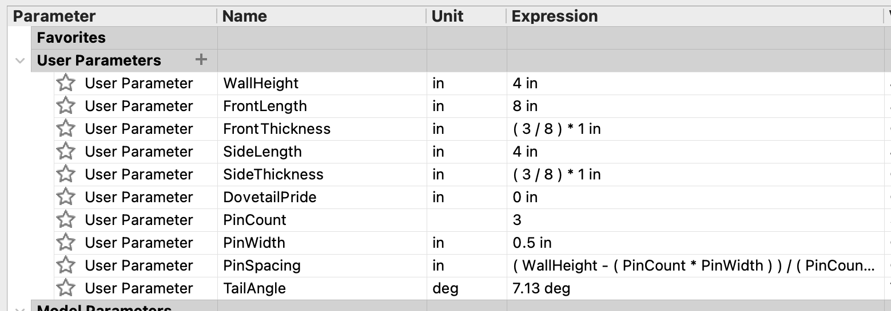
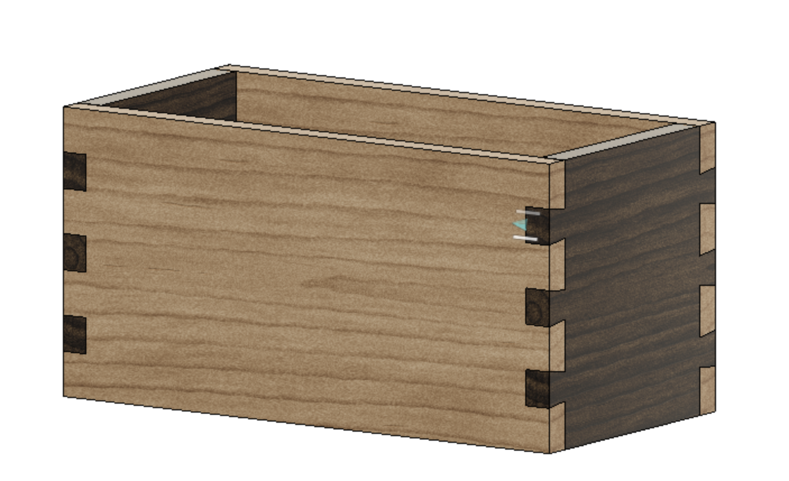
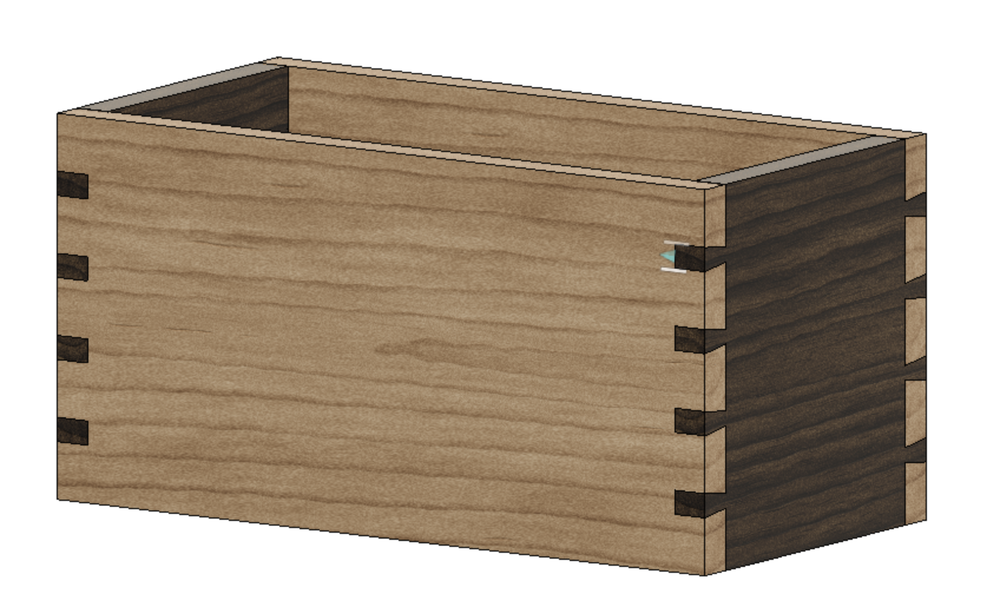
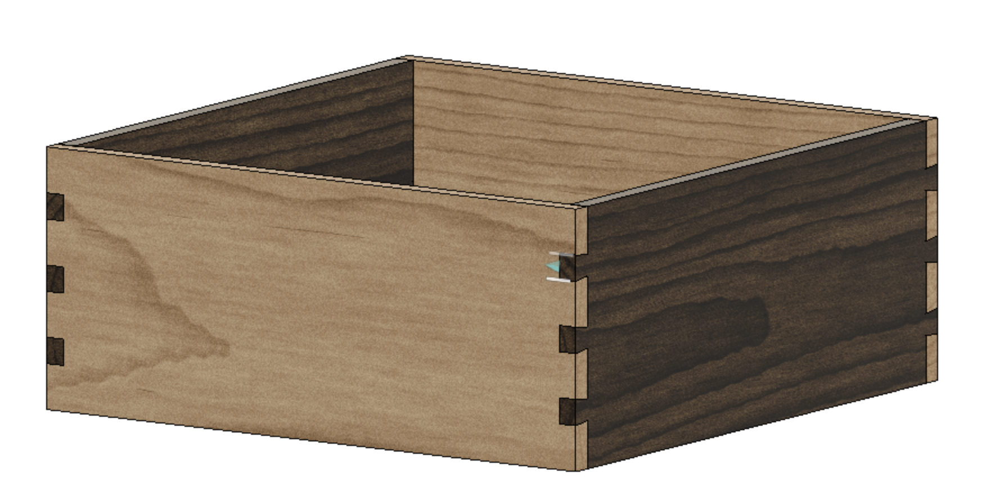

# fusion-360-dovetail-box

Simple Fusion 360 plans for a dovetailed box.

The design has parameters that allow you to adjust the dimensions and thickness of the box, as well as the size and number of dovetails. 

While I still lay out my pins by hand, this is a useful tool for visualizing how you may want to size your pins and box. You can also change the appearance of materials to get an idea for which wood you want to use!

## Parameters

The following parameters are available: 

Most of them are self-explanatory. However, adding a few important call-outs below: 

* **DovetailPride** - just ignore this / leave as zero. I forgot to incorporate it into the design, but the idea is that you could set this to non-zero if you wanted the tails and pins to protrude beyond the box walls.

* **TailAngle** - this is the angle of the tails. Note that 7.13 degrees = 1:8 ratio, typical for hardwood. If you're working with softwood, a 1:5 ratio is common and you can change this value to `11.31 degrees`.

* **PinSpacing** - this calculates the distance between pins and has a formula that evenly spaces your pins. You should not need to change this. 

* **PinCount** - number of pins visible on the front/back face of the box. Change as desired. 

* **PinWidth** - size of the visible pins. Change as desired. 

## Note on changing PinCount and PinWidth

For unknown reasons, I've found that if I change the pin sizing/count in such a way that they are too large to fit on the box edges and, **after** that, I change the settings back to a previously-working set of values, Fusion360 does not calculate pin position correctly. 

If you find this happening, the trick is to `Edit->Undo` (e.g. CTRL+Z or CMD+Z) to get back to a previously working config. Then, keep experimenting with small incremental changes that fit within your box. 

## Examples

Here's the default box from the project, with `PinCount = 3` and `PinWidth = 0.5`.

Here, I've set `PinCount = 4` and `PinWidth = 0.25`.

    

Of course, you could also change the box dimensions themselves. Here, I'm using the same pin configuration as Example 1 but making the box larger and square: 

    